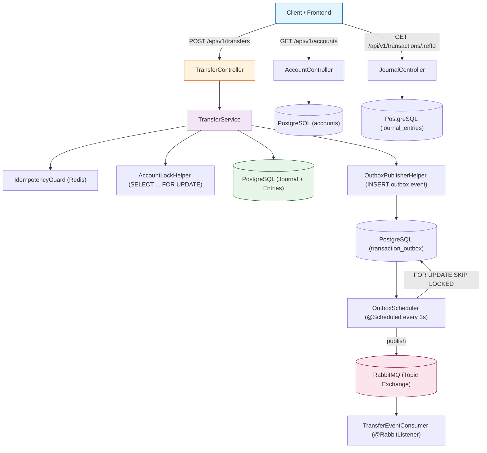

# Ledger Engine

A double-entry bookkeeping engine — the kind of thing banks use under the hood to make sure money doesn't disappear when you transfer it.

Built with Java 17 + Spring Boot 3, backed by PostgreSQL, cached with Redis, and wired to RabbitMQ for async event delivery.

---

## Architecture



## What it does

You've got accounts. You want to move money between them. This engine makes sure:

- **Your balance is always correct** — no partial updates, no race conditions
- **Double-charging is impossible** — every transfer has a unique reference ID; send it twice and the second one is silently ignored
- **Nothing gets lost** — events go to an outbox table first, then RabbitMQ picks them up reliably
- **Two people can transfer at the same time** — pessimistic locks with sorted IDs prevent deadlocks

## You can run it right now

```bash
# Start Postgres, Redis, RabbitMQ
docker compose -f deployments/docker-compose.yml up -d

# Start the backend
./mvnw spring-boot:run

# In another terminal, start the frontend
cd frontend && npm install && npm run dev
```

The backend runs on `http://localhost:8081`, frontend on `http://localhost:5173`. Swagger docs live at `/swagger-ui.html`.

On startup, the app seeds two demo accounts (Alice with $1,000, Bob with $500) so you can play immediately.

## Tech stack

| Layer | What | Why |
|-------|------|-----|
| Language | Java 17 | Records, sealed classes, pattern matching |
| Framework | Spring Boot 3.3.4 | It's what production Java looks like |
| Database | PostgreSQL 16 | ACID compliance, immutable ledger |
| Cache | Redis 7 | Idempotency fast path |
| Messaging | RabbitMQ 3.13 | Async event streaming for downstream consumers |
| Frontend | React 19 + TypeScript + shadcn/ui | Dashboard to see it in action |
| Build | Maven + Vite | Standard tooling for both sides |
| Infra | Docker Compose | One command to spin up everything |

## API in action

### Transfer money

```http
POST /api/v1/transfers
Content-Type: application/json

{
  "referenceId": "my-unique-id-001",
  "sourceAccountId": "alice-uuid-here",
  "destinationAccountId": "bob-uuid-here",
  "amount": 100.00,
  "description": "Lunch money"
}
```

Send the same `referenceId` again and it returns `SUCCESS_DUPLICATE_IGNORED` — no double-charge.

### Check an account

```http
GET /api/v1/accounts/{id}
```

Returns current balance (calculated on the fly from all entries).

### Check a transaction

```http
GET /api/v1/transactions/{referenceId}
```

Returns the journal entry and its debit/credit lines.

### List all accounts

```http
GET /api/v1/accounts
```

Returns every account with its live balance.

### Account history

```http
GET /api/v1/accounts/{id}/entries?page=0&size=10
```

Paginated transaction history for a single account.

## How it works under the hood

### Balances are calculated, not stored

Accounts don't have a `balance` column. Every transfer creates a journal entry with two account entries — one negative (debit from sender) and one positive (credit to receiver). The balance is always `SUM(amount)`. This means:

- You can never "lose" money — every debit has a matching credit
- Full audit trail — every cent is traceable
- Zero-sum invariant — total across all accounts is always zero

### No deadlocks, even under concurrency

If Alice sends to Bob while Bob sends to Alice, naive database locking causes a deadlock (each transaction waits for the other). The engine sorts account IDs before locking, so the lock order is always consistent — deadlock impossible.

### Idempotency in two layers

1. **Redis** — fast check before touching the database (24-hour TTL)
2. **PostgreSQL unique constraint** — source of truth, survives Redis failures

### Transactional Outbox

Publishing a RabbitMQ message inside a DB transaction is risky — the DB might roll back but the message is already sent. The outbox pattern fixes this: the event is written to a `transaction_outbox` table *in the same transaction* as the ledger entries. A scheduler polls this table every 3 seconds (with `FOR UPDATE SKIP LOCKED` for safety), publishes to RabbitMQ, and marks them as published.

## Project structure

```
src/main/java/tn/finix/ledgerengine/
├── config/              # RabbitMQ queues, demo data seeder
├── consumer/            # RabbitMQ event listener
├── controller/          # REST controllers
├── dto/                 # Request/response types
├── entity/              # JPA models: Account, JournalEntry, AccountEntry, Outbox
├── exception/           # Custom errors + global handler
├── repository/          # Spring Data JPA interfaces
├── scheduler/           # Polls outbox, publishes to RabbitMQ
└── service/             # Transfer logic + idempotency + locking helpers

frontend/src/
├── components/          # React UI components
├── hooks/               # Data fetching
├── lib/                 # API client
├── pages/               # Dashboard, Account, Transfer, Lookup
└── types/               # TypeScript interfaces
```
